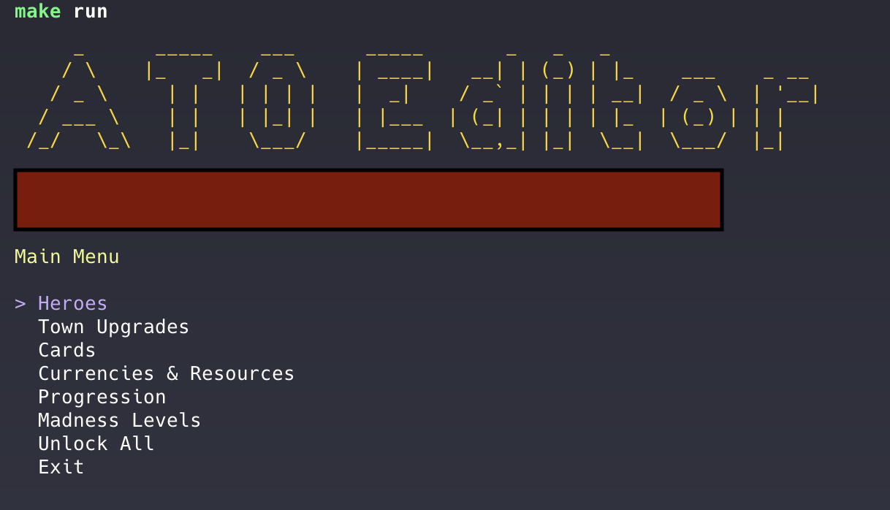

# UnlockTheObelisk (Mac Fork)

Fork of the original UnlockTheObelisk with Mac support and an interactive TUI editor.

Simple command line tool for unlocking various things in the game Across The Obelisk.

Run at your own risk. I'm not responsible if it ruins your game data, corrupts your hard drive, destroys your marriage, or anything else.

## Quick Start (Mac)

```bash
# Install .NET 6
brew install dotnet@6

# Build and run TUI
make run

# Or quick unlock everything
make cli-all
```

## Features

### Interactive TUI Mode (Default)
Launch the editor with just the save file path to get an interactive menu:


- **Heroes** - Select which heroes to unlock
- **Town Upgrades** - Unlock by tier (1-6) or all
- **Cards** - View and manage unlocked cards
- **Currencies & Resources** - Set Supply, Perk Points, Hero Progress
- **Progression** - Toggle NG+ and set level
- **Madness Levels** - Set Obelisk/Adventure/Singularity madness
- **Unlock All** - Quick option to max everything


### CLI Mode
Pass arguments directly for quick unlocks without the interactive menu.

---

## Mac Setup & Usage

### Prerequisites
Install .NET 6 SDK:
```bash
brew install dotnet@6
```

### Build
The `.csproj` is pre-configured for Mac Steam installations. Just build:
```bash
/opt/homebrew/opt/dotnet@6/bin/dotnet build
```

If your game is installed elsewhere, edit `ATOUnlocker/ATOUnlocker.csproj` and update the `gamePath` property to point to your game's `Managed` folder:
```
~/Library/Application Support/Steam/steamapps/common/Across the Obelisk/Contents/Resources/Data/Managed/
```

### Backup Your Save
**BACK UP YOUR SAVE DATA BEFORE RUNNING.**

Your save data is at:
```
~/Library/Application Support/Dreamsite Games/AcrossTheObelisk/STEAM_ID/player.ato
```

Create a backup:
```bash
cp ~/Library/Application\ Support/Dreamsite\ Games/AcrossTheObelisk/YOUR_STEAM_ID/player.ato ~/Library/Application\ Support/Dreamsite\ Games/AcrossTheObelisk/YOUR_STEAM_ID/player_backup.ato
```

### Run

**Interactive TUI Mode (default):**
```bash
/opt/homebrew/opt/dotnet@6/bin/dotnet ATOUnlocker/bin/Debug/net6.0/ATOUnlocker.dll "$HOME/Library/Application Support/Dreamsite Games/AcrossTheObelisk/YOUR_STEAM_ID/player.ato"
```

**CLI Mode (legacy):**
```bash
# Unlock everything
/opt/homebrew/opt/dotnet@6/bin/dotnet ATOUnlocker/bin/Debug/net6.0/ATOUnlocker.dll "$HOME/Library/Application Support/Dreamsite Games/AcrossTheObelisk/YOUR_STEAM_ID/player.ato" town perks heroes

# Just unlock town upgrades
/opt/homebrew/opt/dotnet@6/bin/dotnet ATOUnlocker/bin/Debug/net6.0/ATOUnlocker.dll "$HOME/Library/Application Support/Dreamsite Games/AcrossTheObelisk/YOUR_STEAM_ID/player.ato" town
```

**CLI Arguments:**
- `perks` - max out all perk points
- `heroes` - unlock all heroes
- `town` - unlock all town upgrades

### Makefile Commands

The Makefile auto-detects your Steam ID and save file:

```bash
make help        # Show all commands
make build       # Build the project
make run         # Launch interactive TUI
make cli-all     # Unlock everything (auto-backups first)
make cli-heroes  # Unlock all heroes
make cli-town    # Unlock all town upgrades
make cli-perks   # Max out perk points
make backup      # Backup your save
make restore     # Restore from latest backup
make find-save   # Show detected save path
make clean       # Clean build artifacts
```

---

## Windows Setup & Usage

### Build
Edit the `.csproj` and update `gamePath` to your Windows installation:
```
D:\SteamLibrary\steamapps\common\Across the Obelisk\AcrossTheObelisk_Data\Managed\
```

Then build with Visual Studio, Rider, or `dotnet build`.

### Backup Your Save
Save data is at:
```
C:\Users\USER_NAME\AppData\LocalLow\Dreamsite Games\AcrossTheObelisk\STEAM_ID\player.ato
```

### Run

**Interactive TUI Mode (default):**
```
.\ATOUnlocker.exe "PATH_TO_player.ato"
```

**CLI Mode:**
```
.\ATOUnlocker.exe "PATH_TO_player.ato" town perks heroes
```
